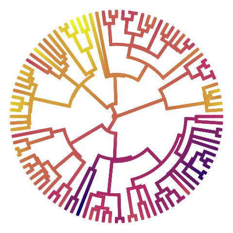

```{r, include=FALSE}
knitr::opts_chunk$set(
  results='asis', 
  echo = FALSE
)

library(magrittr) # For the pipe
source("cv_printing_functions.r")

# Read in all data and initialize a CV printer object
# CV <- create_CV_object(
#   data_location = "https://docs.google.com/spreadsheets/d/14MQICF2F8-vf8CKPF1m4lyGKO6_thG-4aSwat1e2TWc",  
#   pdf_mode = params$pdf_mode,
#   cache_data = params$cache_data
# )

CV <- readr::read_rds('cached_positions.rds')

```


```{r}
# When in pdf export mode the little dots are unaligned, so fix that with some conditional CSS.
if(params$pdf_mode) {
    cat("
<style>
:root{
  --decorator-outer-offset-left: -6.5px;
}
</style>")
}
```


Aside
================================================================================


{width=100%}


```{r}
if(params$pdf_mode){
  cat("View this Resume online with links at _wrroberts.github.io/cv/_")
} else {
  cat("[<i class='fas fa-download'></i> Download a PDF of this CV](https://github.com/wrroberts/cv/raw/master/roberts_cv.pdf)")
}
```

Contact {#contact}
--------------------------------------------------------------------------------

```{r}
CV %>% print_contact_info()
```


Language Skills {#skills}
--------------------------------------------------------------------------------

```{r}
CV %>% print_skill_bars()
```


More info {#more-info}
--------------------------------------------------------------------------------

See full CV at [wrroberts.github.io](https://wrroberts.github.io) for more complete list of positions and publications.


Disclaimer {#disclaimer}
--------------------------------------------------------------------------------

Made with the R package [**pagedown**](https://github.com/rstudio/pagedown). 

The source code is available on [github.com/wrroberts/cv](https://github.com/wrroberts/cv).

Last updated on `r Sys.Date()`.


Main
================================================================================

Wade Roberts {#title}
--------------------------------------------------------------------------------

```{r}
# Note the special double pipe so we modify the CV object in place
CV %<>% print_text_block("intro") 
```


Experience {data-icon=suitcase}
--------------------------------------------------------------------------------

```{r}
CV %<>% print_section('experience')
```


Education {data-icon=graduation-cap data-concise=true}
--------------------------------------------------------------------------------

```{r}
CV %<>% print_section('education')
```


<!-- These breaks just force a new page so section doesnt get cut off -->
<br>
<br>
<br>

Teaching and Outreach {data-icon=chalkboard-teacher}
--------------------------------------------------------------------------------


```{r}
CV %<>% print_section('teaching_outreach')
```


```{r}
CV %<>% print_links()
```

